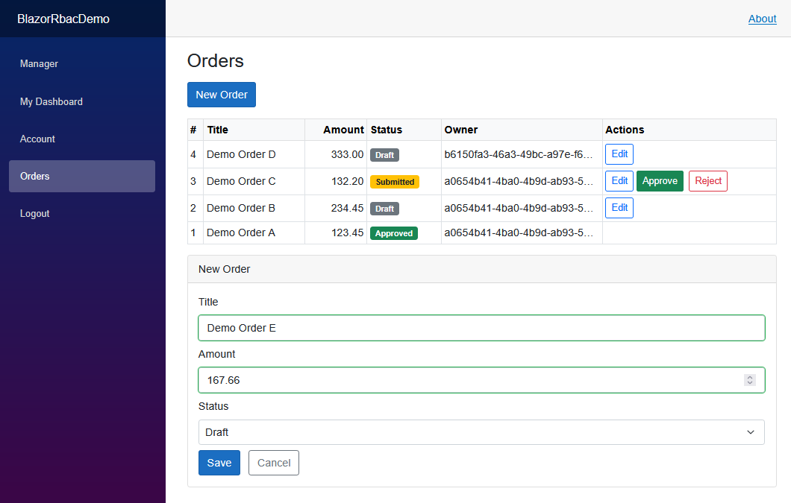
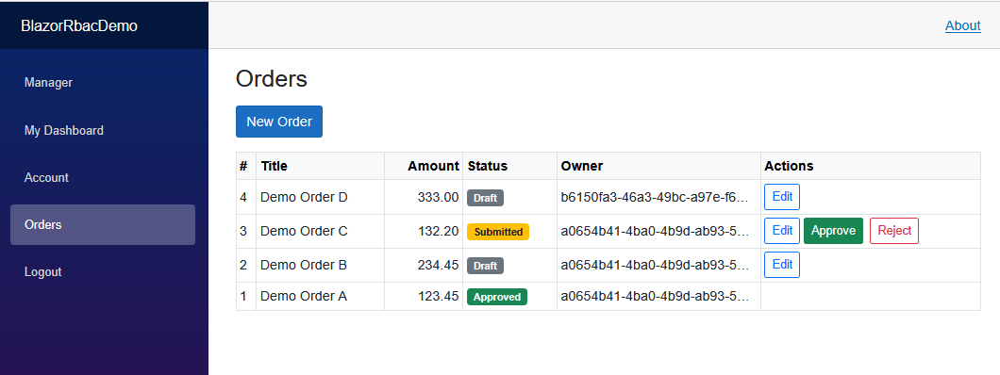
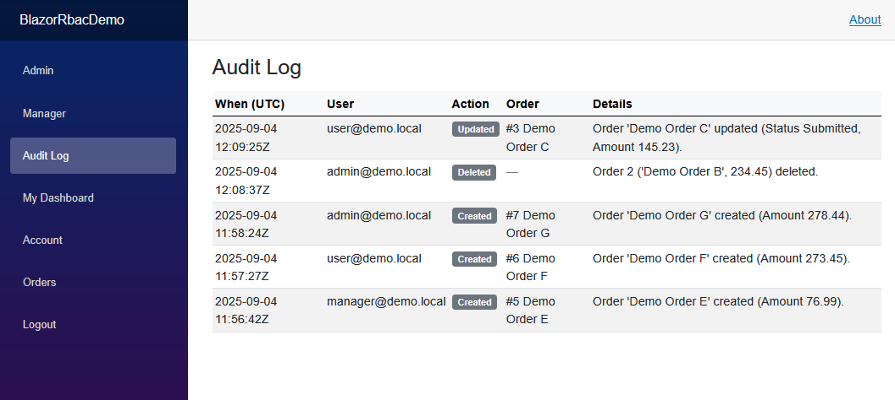

# Blazor RBAC Demo

  
  
  

Role-based access control (RBAC) demo built with **Blazor Server (.NET 9)** and **ASP.NET Core Identity**.  
This project demonstrates common enterprise patterns through two focused case studies:

- **Case Study 1: RBAC Dashboards + Policies**  
  Seeded roles (Admin / Manager / User), claims-based policies (`CanApprove`, `CanExport`), guarded dashboards, and Admin-only CSV export.

- **Case Study 2: Orders CRUD + Approvals**  
  Full CRUD page for an `Order` entity with role-gated actions:  
  - Users can create/edit their own orders.  
  - Managers can approve/reject submitted orders.  
  - Admins can edit/delete any order and export to CSV.

  - **Case Study 3: Audit Log / Activity History**  
  Full CRUD page for an `Order` entity with role-gated actions:  
  - Tracks key user actions (create, update, approve, reject, delete) on Orders.
  - Each log entry records timestamp, user, action type, and details for accountability.

---

## ✨ Highlights

- **ASP.NET Core Identity** with EF Core (SQLite)
- **Seeded roles & users**: Admin, Manager, User
- **Case Study 1: Dashboards & Policies**  
  - Claims-based policies: `CanApprove`, `CanExport`  
  - Role-based dashboards: Admin / Manager / User  
  - Admin-only CSV export at `/exports/system-report.csv`
- **Case Study 2: Orders CRUD + Approvals**  
  - Create, edit, delete, approve, reject workflow  
  - Role-gated actions (User, Manager, Admin)  
  - Concurrency-safe EF Core updates
- **Case Study 3: Audit Log / Activity History**  
  - Automatic audit logging on all order actions
  - Viewable logs page (/logs) for Admins
  - Robust handling of deletes (retains history even when order is gone)
- Clean **Nav** using `<AuthorizeView>` and protected routes via `[Authorize]`

---

## Seeded Users

(Demo accounts are seeded locally for testing — not connected to any external service.)

| Role    | Email                 | Password   | Access                          |
|---------|-----------------------|------------|---------------------------------|
| Admin   | `admin@demo.local`   | `P@ssw0rd!` | Admin + Manager + User pages<br/>Can Approve + Export |
| Manager | `manager@demo.local` | `P@ssw0rd!` | Manager + User pages<br/>Can Approve |
| User    | `user@demo.local`    | `P@ssw0rd!` | User dashboard only |

---

🔒 Policies

CanApprove → requires claim perm=approve (Manager/Admin)

CanExport → Admin role or claim perm=export

Configured in Program.cs:

opts.AddPolicy("CanApprove", p => p.RequireClaim("perm", "approve"));
opts.AddPolicy("CanExport",  p => p.RequireAssertion(ctx =>
    ctx.User.IsInRole("Admin") || ctx.User.HasClaim("perm","export")));

---

🧭 Pages

Home (/) – role matrix, quick links, login status

My Dashboard (/me) – profile card, role badges, claims viewer

Manager (/manager) – pending requests table, approve action (policy-gated)

Admin (/admin) – Admin-only; CSV export link (policy-gated)

Orders (/orders) – CRUD + approvals with role/claim enforcement

Audit Logs (/logs) – activity history with filters by action/user

---

📄 CSV Export

Minimal API endpoint protected by CanExport:

GET /exports/system-report.csv

---

## 🛠Running Locally

1. Clone the repo:
   ```bash
   git clone https://github.com/<your-username>/BlazorRbacDemo.git
   cd BlazorRbacDemo
2. Apply migrations & create the SQLite database:
   dotnet ef database update
3. Run the app:
   dotnet run
4. Navigate to https://localhost:5001

## 📸 Screenshots

### Case Study 1: RBAC Dashboards + Policies

#### 🔐 Login


#### 🏠 Home / Role Matrix


#### 👤 User Dashboard


#### 👔 Manager Dashboard


#### 🛡️ Admin Dashboard


---
### Case Study 2: Orders CRUD + Approvals

#### 📦 Orders CRUD
Users can create new orders, Managers can approve/reject submitted orders, and Admins have full control (edit/delete).  

#### ✏️ Add / Edit Order


#### 📋 Orders List


---
### Case Study 3: Activity History

#### 📜 Audit Logs
Admins can review all order actions (create, update, approve, reject, delete).
Entries show timestamp, user, action, and details for traceability.



🔮 Next Steps

**Case Study 1: RBAC Dashboards + Policies**
- [ ] Add external authentication providers (Google, Microsoft, etc.)
- [ ] Role management UI for Admins (create/edit roles, assign users)
- [ ] Expand claims-based policies (e.g., `CanDelete`, `CanViewReports`)

**Case Study 2: Orders CRUD + Approvals**
- [ ] Add file attachments (e.g., PDFs, invoices) to orders
- [ ] Add pagination, filtering, and search to the Orders grid
- [ ] Export orders to CSV/Excel (Admin only)

**Case Study 3: Audit Logs / Activity History**
- [ ] Add filtering by user/date/action
- [ ] Export logs to CSV/Excel
- [ ] Integrate with external monitoring tools

**General / Infrastructure**
- [ ] Replace SQLite with SQL Server/PostgreSQL for enterprise workflows
- [ ] Deploy to Azure App Service for live demo access
- [ ] Improve UI polish with Bootstrap cards, modals, and responsive layout 


📚 Tech Stack

Blazor Server (.NET 9)

ASP.NET Core Identity

Entity Framework Core 9 (SQLite provider)

Bootstrap 5 for UI

---

📦 Project structure (key files)
Data/
  AppDbContext.cs        # AppUser + DbContext
  SeedDataService.cs     # seeds roles/users/claims
Models/
  Order.cs               # Order entity
  AuditLog.cs            # Audit entity
Pages/
  Index.razor            # Role matrix & quick links
  Me.razor               # Profile dashboard
  Manager.razor          # Approvals (policy-gated)
  Admin.razor            # Export (policy-gated)
  Orders.razor           # Orders CRUD + approvals
  Logs.razor             # Audit log viewer
  Shared/_LoginPartial.cshtml
Program.cs               # Identity, policies, minimal API for CSV

---

📝 Notes

This is a demo project—credentials and claims are seeded in code for clarity.

Swap SQLite for SQL Server/Postgres by changing the EF provider & connection string.
