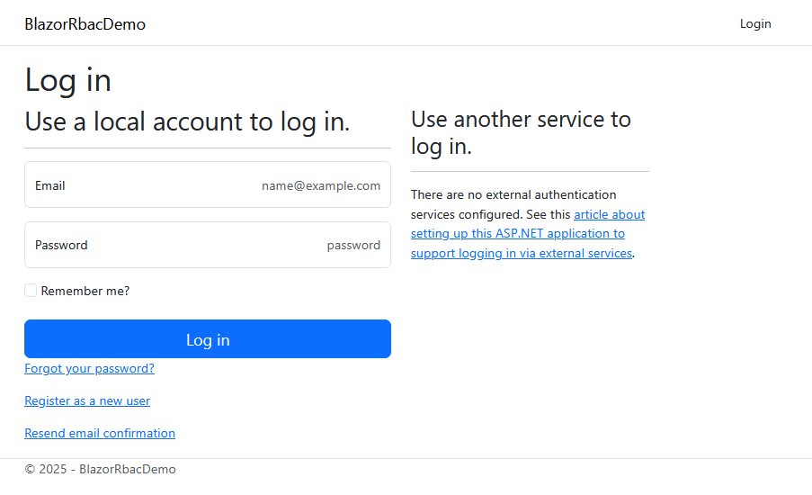
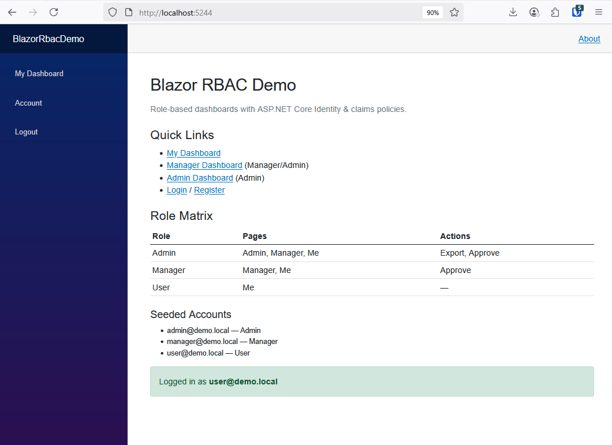
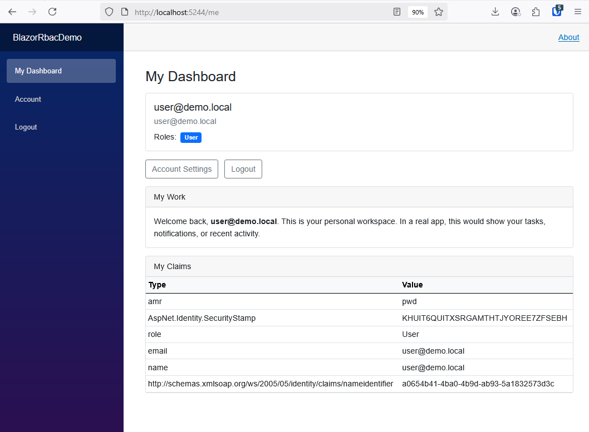
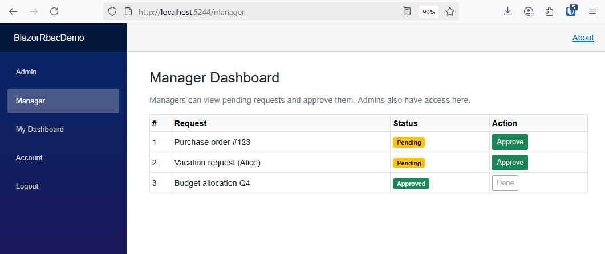
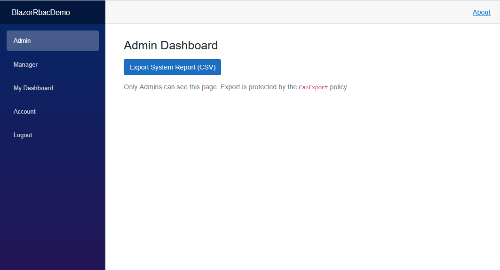
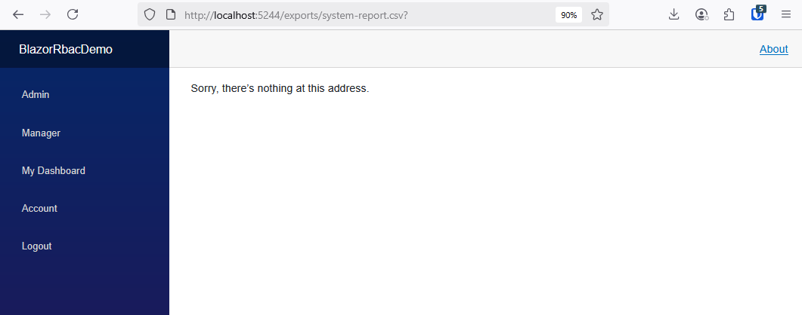

# Blazor RBAC Demo

Role-based access control (RBAC) demo built with **Blazor Server (.NET 9)** and **ASP.NET Core Identity**.  
Shows **roles**, **claims-based policies**, guarded navigation, and **Admin-only CSV export**—the kind of patterns common in ERP/LOB apps.

---

## ✨ Highlights

- **ASP.NET Core Identity** with EF Core (SQLite)
- **Seeded roles & users**: Admin, Manager, User
- **Claims-based policies**: `CanApprove`, `CanExport`
- **Role-based dashboards**: Admin / Manager / User
- **Admin-only CSV export** at `/exports/system-report.csv`
- Clean **Nav** using `<AuthorizeView>` and protected routes via `[Authorize]`
---

## Seeded Users

| Role    | Email                 | Password   | Access                          |
|---------|-----------------------|------------|---------------------------------|
| Admin   | `admin@demo.local`   | `P@ssw0rd!` | Admin + Manager + User pages<br/>Can Approve + Export |
| Manager | `manager@demo.local` | `P@ssw0rd!` | Manager + User pages<br/>Can Approve |
| User    | `user@demo.local`    | `P@ssw0rd!` | User dashboard only |

---

🔒 Policies

CanApprove → requires claim perm=approve (Manager/Admin)

CanExport → Admin role or claim perm=export

Configured in Program.cs:

opts.AddPolicy("CanApprove", p => p.RequireClaim("perm", "approve"));
opts.AddPolicy("CanExport",  p => p.RequireAssertion(ctx =>
    ctx.User.IsInRole("Admin") || ctx.User.HasClaim("perm","export")));

---

🧭 Pages

Home (/) – role matrix, quick links, login status

My Dashboard (/me) – profile card, role badges, claims viewer

Manager (/manager) – pending requests table, approve action (policy-gated)

Admin (/admin) – Admin-only; CSV export link (policy-gated)

---

📄 CSV Export

Minimal API endpoint protected by CanExport:

GET /exports/system-report.csv

---

## 🛠Running Locally

1. Clone the repo:
   ```bash
   git clone https://github.com/<your-username>/BlazorRbacDemo.git
   cd BlazorRbacDemo
2. Apply migrations & create the SQLite database:
   dotnet ef database update
3. Run the app:
   dotnet run
4. Navigate to https://localhost:5001

## 📸 Screenshots

### 🔐 Login


### 🏠 Home / Role Matrix


### 👤 User Dashboard


### 👔 Manager Dashboard


### 🛡️ Admin Dashboard


### 📄 CSV Export



🔮 Next Steps

Add a data grid with CRUD operations gated by role

Export reports to CSV/Excel (Admin only)

Replace SQLite with SQL Server or PostgreSQL for enterprise use

Deploy to Azure App Service for live demo access

📚 Tech Stack

Blazor Server (.NET 9)

ASP.NET Core Identity

Entity Framework Core 9 (SQLite provider)

Bootstrap 5 for UI

---

📦 Project structure (key files)
Data/
  AppDbContext.cs        # AppUser + DbContext
  SeedDataService.cs     # seeds roles/users/claims
Pages/
  Index.razor            # Role matrix & quick links
  Me.razor               # Profile dashboard
  Manager.razor          # Approvals (policy-gated)
  Admin.razor            # Export (policy-gated)
  _ViewImports.cshtml
  Shared/_LoginPartial.cshtml
Program.cs               # Identity, policies, minimal API for CSV

---

📝 Notes

This is a demo project—credentials and claims are seeded in code for clarity.

Swap SQLite for SQL Server/Postgres by changing the EF provider & connection string.
